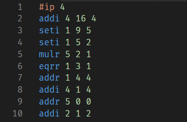
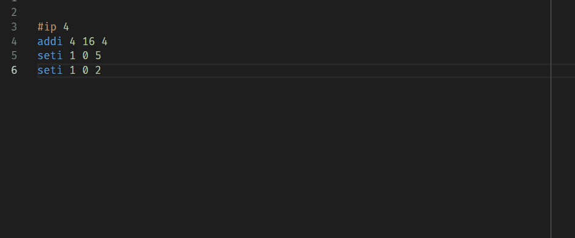
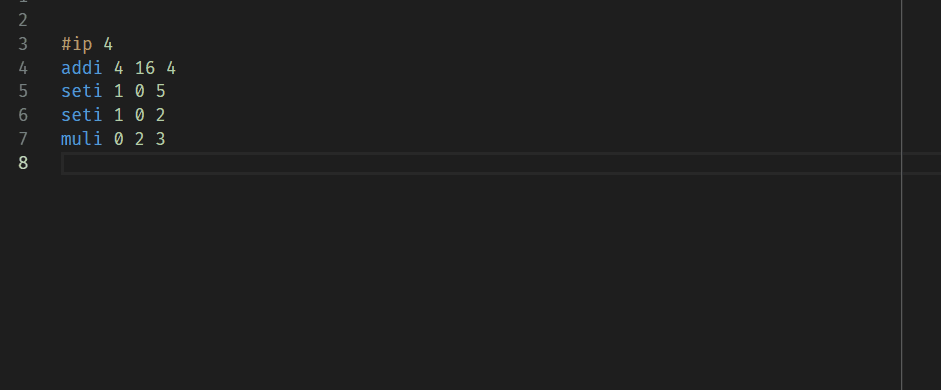

# ElfCode Language Support for Visual Studio Code

This extension provides support for the ElfCode language from Advent of Code 2018. The actual language is described [here](https://adventofcode.com/2018/day/16) and [here](https://adventofcode.com/2018/day/19). The only thing I added is the ability to add line comments, which start with a percentage sign (`%`).

# Getting started
1. Install the extension:
   1. Press `ctrl + p`
   2. Type in `ext install elfcode`
   3. Select the extension and click `Install`
2. Create a file with extension `.ec`, `.elf` or `.elfcode`
3. Start typing some code and (hopefully) enjoy some elf-y goodness

# Features
The extension currently supports the following features:
### Syntax highlighting

### Code snippets

### Some source code validation

## But why?
In the spirit of Christmas I decided to try out something new. I have never created a vscode extension before and I saw ElfCode as a pretty good opportunity to learn something new, since the language is quite simple. So I took the time to actually make this, don't judge me :)

I am also interested in actually making the code run with a debugger or something. I started looking into it but haven't had the time to finish yet. Maybe I'll come back to it a bit later.